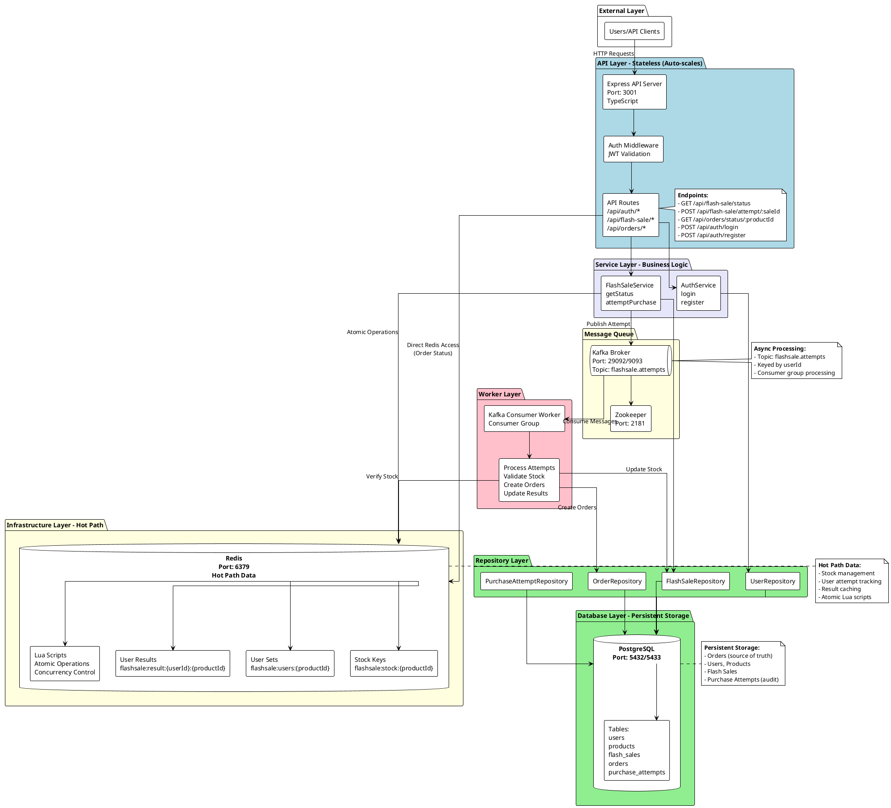
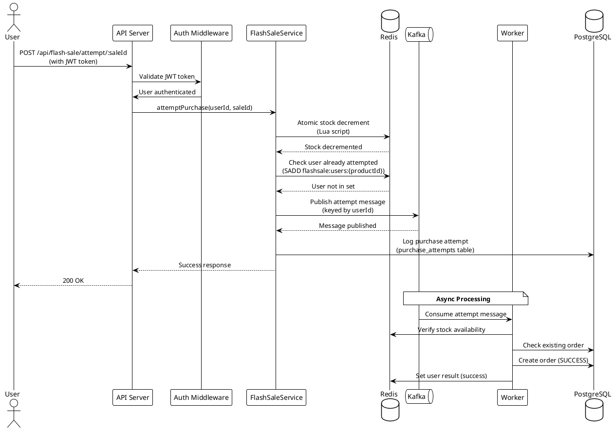
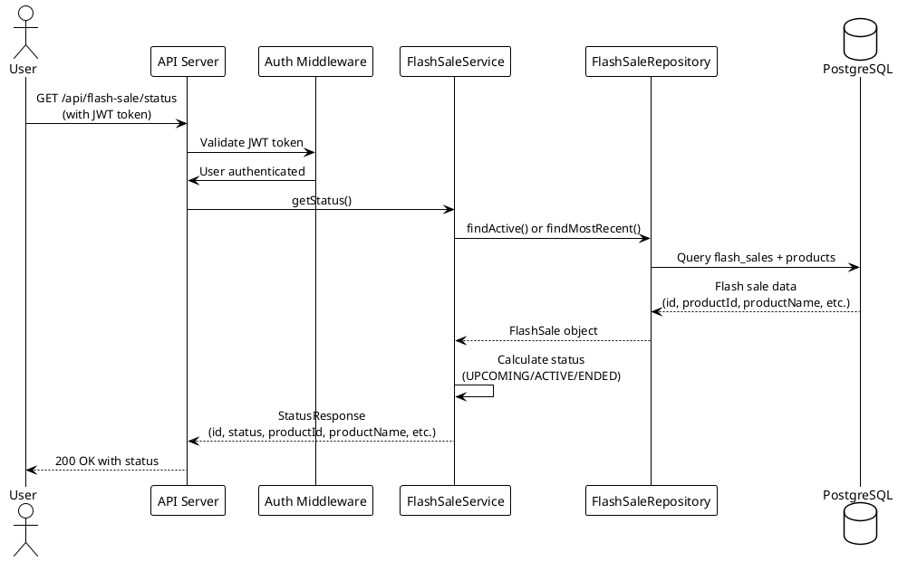
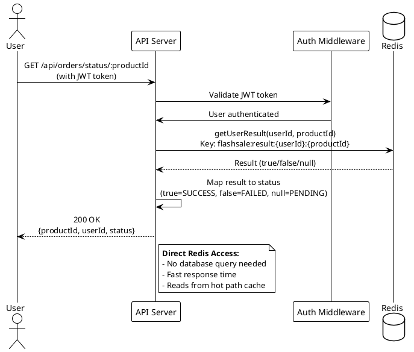
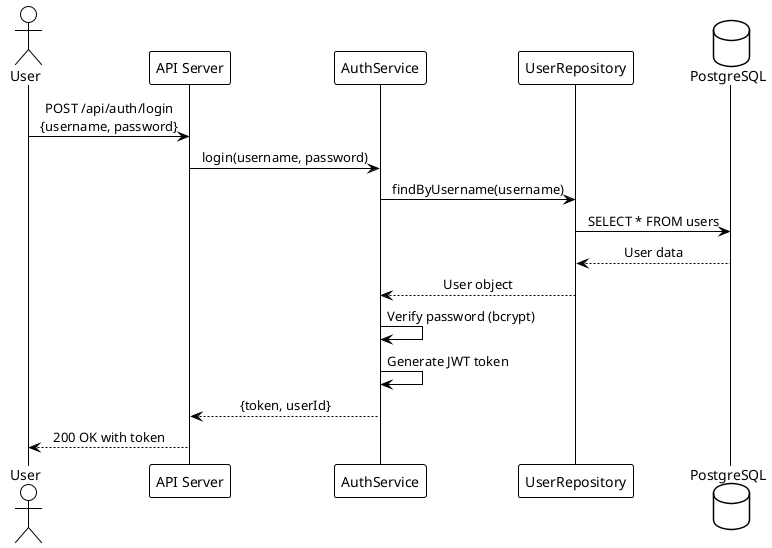

# Flash Sale System Architecture

## System Architecture Diagram

### PlantUML Diagram (PlantText Compatible)

Copy the following PlantUML code to [PlantText](https://www.planttext.com/) to view and edit the diagram:



## Component Interaction Flow

### 1. Purchase Attempt Flow

Copy to [PlantText](https://www.planttext.com/):



### 2. Flash Sale Status Check Flow

Copy to [PlantText](https://www.planttext.com/):



### 3. Order Status Check Flow (Redis Direct Access)

Copy to [PlantText](https://www.planttext.com/):



### 4. Authentication Flow

Copy to [PlantText](https://www.planttext.com/):



### 5. Complete System Architecture (PlantUML Component Diagram)

Copy to [PlantText](https://www.planttext.com/) for a comprehensive view:

```plantuml
@startuml Flash Sale Complete Architecture
!theme plain
skinparam componentStyle rectangle
skinparam linetype ortho
skinparam shadowing false

left to right direction

package "External" {
  [Users/API Clients] as Users
}

package "API Layer" #LightBlue {
  [Express API Server\n:3001] as API
  [Auth Middleware] as AuthMW
  [Routes] as Routes
}

package "Service Layer" #Lavender {
  [FlashSaleService] as FlashSaleSvc
  [AuthService] as AuthSvc
}

package "Infrastructure" #LightYellow {
  database "Redis\n:6379" as Redis
  queue "Kafka\n:29092" as Kafka
  [Zookeeper\n:2181] as Zookeeper
}

package "Worker" #Pink {
  [Kafka Consumer] as Worker
}

package "Database" #LightGreen {
  database "PostgreSQL\n:5432" as PostgreSQL
  [FlashSaleRepository] as FlashSaleRepo
  [OrderRepository] as OrderRepo
  [UserRepository] as UserRepo
  [PurchaseAttemptRepository] as PurchaseAttemptRepo
}

Users --> API
API --> AuthMW
AuthMW --> Routes
Routes --> FlashSaleSvc
Routes --> AuthSvc
Routes --> Redis : Order Status\n(Direct Access)
FlashSaleSvc --> Redis
FlashSaleSvc --> Kafka
FlashSaleSvc --> FlashSaleRepo
AuthSvc --> UserRepo
Kafka --> Zookeeper
Kafka --> Worker
Worker --> Redis
Worker --> OrderRepo
Worker --> FlashSaleRepo
FlashSaleRepo --> PostgreSQL
OrderRepo --> PostgreSQL
UserRepo --> PostgreSQL
PurchaseAttemptRepo --> PostgreSQL

note right of Redis
  **Hot Path:**
  - Stock: flashsale:stock:{id}
  - Users: flashsale:users:{id}
  - Results: flashsale:result:{userId}:{id}
  - Lua Scripts (Atomic)
end note

note right of Kafka
  **Topic:** flashsale.attempts
  **Key:** userId
  **Partitions:** 1
end note

note right of PostgreSQL
  **Tables:**
  - users
  - products
  - flash_sales
  - orders
  - purchase_attempts
end note

@enduml
```

## Technology Stack

### Core Technologies
- **Runtime**: Node.js 20+
- **Language**: TypeScript
- **Framework**: Express.js
- **Database**: PostgreSQL 15
- **Cache**: Redis 7
- **Message Queue**: Apache Kafka 7.5.0
- **Containerization**: Docker & Docker Compose

### Key Libraries
- **Authentication**: jsonwebtoken, bcrypt
- **Database**: pg (PostgreSQL client)
- **Redis**: ioredis
- **Kafka**: kafkajs
- **API Documentation**: swagger-jsdoc, swagger-ui-express
- **Logging**: winston

## Data Flow Patterns

### Hot Path (Redis)
- **Stock Management**: Real-time stock count (`flashsale:stock:{productId}`)
- **User Tracking**: Users who attempted purchase (`flashsale:users:{productId}`)
- **Results Cache**: Purchase results (`flashsale:result:{userId}:{productId}`)
  - Used by `/api/orders/status/:productId` endpoint for direct Redis access
  - Returns: `SUCCESS`, `FAILED`, or `PENDING` status
- **Atomic Operations**: Lua scripts ensure concurrency control

### Cold Path (PostgreSQL)
- **Persistent Storage**: Orders, users, products, flash sales
- **Audit Trail**: Purchase attempts log
- **Data Integrity**: Foreign keys, unique constraints
- **Flash Sale Status**: Queries flash_sales and products tables for status endpoint

### Async Processing (Kafka)
- **Message Topic**: `flashsale.attempts` (keyed by userId)
- **Consumer Group**: `flash-sale-worker-group`
- **Processing**: Worker consumes messages and creates orders
- **Result Storage**: Worker sets purchase results in Redis after processing

## Scalability Features

1. **Stateless API**: Can scale horizontally
2. **Redis Cluster**: Supports horizontal scaling
3. **Kafka Partitions**: Enables parallel processing
4. **Worker Consumer Groups**: Multiple workers can process messages
5. **Database Connection Pooling**: Efficient database connections

## Security Features

1. **JWT Authentication**: Token-based auth for API endpoints
2. **Password Hashing**: bcrypt for secure password storage
3. **CORS**: Configured for frontend access
4. **Input Validation**: Request validation on all endpoints

## Fault Tolerance

1. **Redis Retry Logic**: Automatic reconnection
2. **Kafka Non-blocking**: API doesn't fail if Kafka is unavailable
3. **Stock Rollback**: Stock restored if Kafka publish fails
4. **Database Transactions**: ACID compliance for data integrity
5. **Health Checks**: Docker health checks for all services

## Using PlantText

To view and edit these diagrams:

1. Go to [PlantText](https://www.planttext.com/)
2. Copy any of the PlantUML code blocks above (between `@startuml` and `@enduml`)
3. Paste into the PlantText editor
4. The diagram will render automatically
5. You can edit, export (PNG, SVG, PDF), or share the diagram

### Available Diagrams

1. **Flash Sale System Architecture** - Complete system overview
2. **Purchase Attempt Flow** - Sequence diagram for purchase flow
3. **Flash Sale Status Check Flow** - Sequence diagram for flash sale status check
4. **Order Status Check Flow** - Sequence diagram for order status check (direct Redis access)
5. **Authentication Flow** - Sequence diagram for login
6. **Complete System Architecture** - Comprehensive component diagram

## API Endpoints Summary

### Flash Sale Endpoints
- **GET /api/flash-sale/status** - Get current flash sale status (returns id, status, productId, productName, productDescription)
- **POST /api/flash-sale/attempt/:saleId** - Attempt to purchase an item (requires JWT token)

### Order Endpoints
- **GET /api/orders/status/:productId** - Get order status from Redis (requires JWT token, reads directly from Redis cache)

### Authentication Endpoints
- **POST /api/auth/login** - User login (returns JWT token)
- **POST /api/auth/register** - User registration

## Key Architecture Updates

### Order Status Endpoint Optimization
- **Changed from**: `/api/orders/status/:saleId` (queried database to get productId)
- **Changed to**: `/api/orders/status/:productId` (reads directly from Redis)
- **Benefits**:
  - No database query required
  - Faster response time
  - Reduced database load
  - Direct access to hot path data in Redis

### Flash Sale Status Enhancement
- **Added**: `productId` field to status response
- **Response includes**: id, status, startTime, endTime, currentTime, productId, productName, productDescription
